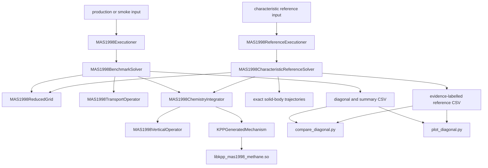

# MAS1998 独立应用架构

## 1. 范围与所有权

MAS1998 论文复现已从 MOOSE 的 `atmospheric_chemistry` 模块迁移到独立应用：

```text
/home/fangxiaozhong/git_repo/mas1998_benchmark
```

分界原则是：论文专用的网格、常数、时间离散、算子分裂、KPP 机制、输入和诊断全部由
独立 app 拥有；MOOSE 模块只提供可被其他大气化学应用复用的框架能力。当前模块侧为本
复现新增的唯一功能是 `KPPGeneratedMechanism` 的通用 KPP production/loss 与固定物种接口。

这套实现复现数值模型，不复现 Cray C90 硬件性能、Fortran 向量化指令或 autotasking。

## 2. 仓库结构

```text
mas1998_benchmark/
|-- include/, src/
|   |-- executioners/MAS1998{,Reference}Executioner.*
|   |-- utils/MAS1998BenchmarkSolver.*
|   |-- utils/MAS1998CharacteristicReferenceSolver.*
|   |-- utils/MAS1998ReducedGrid.*
|   |-- utils/MAS1998TransportOperator.*
|   |-- utils/MAS1998VerticalOperator.*
|   |-- utils/MAS1998ChemistryIntegrator.*
|   |-- utils/MAS1998BenchmarkUtils.*
|   |-- functions/MAS1998*Function.*
|   |-- ics/MAS1998SpeciesIC.*
|   `-- fvkernels/AtmosphericSphericalFV*.*
|-- test/tests/mas1998/
|   |-- chemistry/mas1998_methane.*
|   |-- production/                 # 6 个 Table 3 算例
|   |-- reference/                 # 特征线候选、收敛输入及旧细化输入
|   |-- mas1998_complete_type_{i,ii}_smoke.i
|   |-- mas1998_characteristic_reference_smoke.i
|   `-- tests
|-- unit/src/MAS1998*Test.C
`-- scripts/
    |-- compare_diagonal.py
    |-- plot_diagonal.py
    `-- run_quantitative_reproduction.sh

moose/modules/atmospheric_chemistry/
`-- include/utils,src/utils/KPPGeneratedMechanism.*
```

旧的 `MAS1998*Function`、`MAS1998SpeciesIC` 和球面 FV 对象保留在 app 内，用于静态物理
与既有 FV smoke test；完整论文算例走下述专用数组求解器，不依赖 libMesh 用普通拓扑去
近似论文的约化纬圈连接。

## 3. 运行时数据流



`MAS1998Executioner` 是 MOOSE 输入入口。它验证单 MPI rank 约束，把输入参数组装成
`MAS1998BenchmarkSolver::Options`，然后运行专用求解器。这个串行约束避免多个 rank 重复
保存同一全局数组和写同一 CSV；它不是对论文 C90 并行实现的复现。

`MAS1998BenchmarkSolver` 的状态按

```text
(horizontal cell, vertical layer, KPP variable species)
```

展平。它初始化 17 个变量物种，执行 Type I 或 Type II Strang 序列，并输出
`lambda'=phi'/2` 的最低层剖面以及全局体积加权总量和最小浓度。CSV 行包含名义经纬网格、
是否约化、分裂类型等元数据。

`MAS1998ReferenceExecutioner` 也是单 MPI rank 入口。它让
`MAS1998CharacteristicReferenceSolver` 在与每个生产剖面完全相同的真实 cell center 上取样，
把终点沿式 (4.1) 解析轨迹反向追踪到初值脚点，再沿正向轨迹仅积分共享的 15 层化学-扩散柱。
因此它绕过 `MAS1998TransportOperator`，消除水平网格、limiter 和水平时间推进误差，同时保留
论文 reference 所保留的垂直空间离散。输出固定标为
`INDEPENDENT_CHARACTERISTIC_REFERENCE`。

## 4. 数值组件

`MAS1998ReducedGrid` 保存每个纬圈的经度单元数、范围和扁平偏移。在不同分辨率纬圈的
公共边界上，它按较细一侧切分面段，用面段中点把南北真实单元配对；这正是论文所述的
piecewise-constant virtual concentration 连接。

`MAS1998TransportOperator` 对每个物种和高度层执行守恒球面通量、三阶迎风 limiter 与显式
两阶段梯形 RK。每个物理面只累计一次，周期经度缝闭合；CFL 检查使用真实东西面以及所有
南北约化面段的绝对通量上界。

`MAS1998VerticalOperator` 在 15 个非均匀中心上组装
`d_z[rho K d_z(c/rho)]` 的三对角矩阵。外部面系数为零，隐式求解使用 Thomas 算法。

`MAS1998ChemistryIntegrator` 在每个 split 子问题起点使用隐式 Euler，后续使用变步长 BDF2。
每一步按 KPP 变量顺序做固定两次标量 Gauss-Seidel sweep。Type I 对每个三维网格点做氮
修正；Type II 对层厚加权的整根垂直柱做氮修正。最低层 NO 排放进入 BDF 守恒目标。

`MAS1998BenchmarkUtils` 是论文常数和解析运动学的单一来源，包括 Table 1、15 个高度中心、
38.2 km 顶、US Standard Atmosphere 近似、式 (4.1) 风场及 Rodrigues 轨迹、式 (4.2) 垂直
扩散系数、`lambda=lambda'+180 deg` 的当地太阳时、物种顺序和氮原子数。

## 5. 通用模块接口

MOOSE 模块的 `KPPGeneratedMechanism` 负责加载 KPP 共享库，并提供：

- 可选解析 `Fun_SPLIT`；
- `computeProductionLoss()`，返回 `dc/dt = P - D*c` 中的 `P` 和 `D`；
- `setFixedSpecies()`/`clearFixedSpecies()`；
- 保持 KPP `PRESS` 全局量为其约定的 mbar；
- `computeSpeciesRates()` 将 `D*c` 转为实际 loss rate。

这些 API 不包含 MAS1998 物种名、反应、网格或时间推进策略。app 在每个网格点和高度层向
它提供温度、mbar 压力、空气密度、H2O、CO、O2、纬度与当地太阳时。

## 6. 输入与验证层次

`production/` 提供 Type I/II 与 `64x32`、`128x64`、`256x128` 的六个 14 天输入。
`reference/characteristic_*.i` 提供三个坐标对齐的 14 天候选参考，`convergence_*.i` 检查
`75 s/8 sweeps` 相对 `37.5 s/12 sweeps` 的时间/迭代收敛。`reference/type_ii_refined.i` 只是
保留的规则网格 Eulerian 对照，不再是首选参考。

验证分为：纯数值单元测试、既有静态物理/FV/0D KPP 测试、Type I/II/特征线参考短时 smoke、
Python 合成误差测试和所有长输入的语法检查。生产 checker 要求 summary 有终止时刻、有限值、
非负总量和非负全局最小值；参考 checker 要求每纬圈恰好一行、证据标签正确且所有浓度有限
非负。14 天任务不属于 CI；`run_quantitative_reproduction.sh` 以独立进程受控并发运行，验证
最终时刻，再生成三份 O3/NOx/HNO3/HO2NO2 误差表和叠加图。

## 7. 证据边界

1. 论文 CWI reference 是作者用精确水平特征线加半离散垂直柱数值生成的。原始
   `Ref_Sol_Benchmark_Global.text` 未能获得；当前同方法重建只能称
   `INDEPENDENT_CHARACTERISTIC_REFERENCE`，不能标成作者原始解。
2. 论文图可直接确定 `64x32` 纬圈表；`128x64` 和 `256x128` 表是对称、单调、二次幂的重建，
   并精确复现 Table 2 总单元数，但不能宣称逐纬圈来自缺失的原始程序。
3. 论文未给出变步长局部误差控制器的全部常数。生产输入采用论文明确允许的恒定 300 s
   化学步，不伪造控制器；因此不是旧 CWI 程序的逐位重放。
4. 化学附录 NM-R9505 描述的是 46 反应/19 物种前身。独立 app 中恢复的最终
   45 反应/17 变量 KPP 机制仍是本 benchmark 的权威机制。
5. 候选参考只有在 `150/4`、`75/8`、`37.5/12` 的预定义 L2/Linf 收敛门槛通过后才能称为
   converged。14 天任务尚未运行时，架构和短测完成不等于定量结果已经复现。
